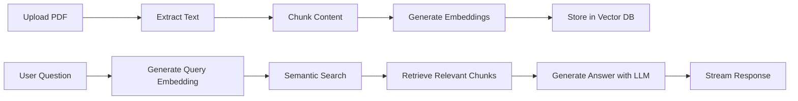

# 🤖 RAG Chatbot - AI-Powered Document Intelligence

[](https://nextjs.org/)
[](https://www.typescriptlang.org/)
[](https://ai.google.dev/)
[](https://neon.tech/)
[](LICENSE)

A powerful **Retrieval-Augmented Generation (RAG)** chatbot that transforms any PDF into instant AI knowledge. Built with Next.js, Google Gemini, and PostgreSQL with pgvector for semantic search.

**🌐 Live Demo:** [https://rag-chatbot-teal.vercel.app/](https://rag-chatbot-teal.vercel.app/)


## ✨ Features

- 🚀 **Real-time Document Processing** - Upload PDFs and get instant semantic indexing
- 🧠 **AI-Powered Responses** - Leverages Google Gemini 2.0 Flash for intelligent answers
- 🔍 **Semantic Search** - Vector database enables lightning-fast similarity search
- 💬 **Natural Conversations** - Chat naturally with your documents
- 🎨 **Neobrutalist UI** - Modern, bold, and accessible design
- 🔒 **Secure Authentication** - Clerk integration for user management
- 📱 **Responsive Design** - Works seamlessly on desktop and mobile
- ⚡ **Optimized Performance** - Built with Next.js 15 and Turbopack

## 🏗️ Architecture

```
┌─────────────┐      ┌──────────────┐      ┌──────────────┐      ┌──────────────┐
│   Chat UI   │─────▶│Route Handler │─────▶│ Search Tool  │─────▶│   Vector DB  │
│             │      │              │      │              │      │              │
│  (Next.js)  │◀─────│ (API Route)  │◀─────│  (Semantic)  │◀─────│ (pgvector)   │
└─────────────┘      └──────────────┘      └──────────────┘      └──────────────┘
       │                     │                      │                     │
       │                     │                      │                     │
   User Input         Process Query        Find Relevant          Store Embeddings
                                          Content (768d)
```

### Tech Stack

| Component | Technology |
|-----------|------------|
| **Framework** | Next.js 15.5.4 with App Router |
| **Language** | TypeScript 5.0 |
| **LLM** | Google Gemini 2.0 Flash |
| **Embeddings** | Google text-embedding-004 (768 dimensions) |
| **Database** | Neon PostgreSQL with pgvector |
| **ORM** | Drizzle ORM |
| **Authentication** | Clerk |
| **PDF Parsing** | pdf-parse-fork |
| **Styling** | Tailwind CSS |
| **UI Components** | Radix UI |
| **Runtime** | Bun |

## 🚀 Getting Started

### Prerequisites

- **Node.js** 18+ or **Bun** 1.0+
- **PostgreSQL** database with pgvector extension (Neon recommended)
- **Google AI API Key** ([Get one here](https://ai.google.dev/))
- **Clerk Account** for authentication ([Sign up](https://clerk.com/))

### Installation

1. **Clone the repository**

```bash
git clone https://github.com/Phynxxx/RAG-Chatbot.git
cd RAG-Chatbot
```

2. **Install dependencies**

```bash
bun install
# or
npm install
```

3. **Set up environment variables**

Create a `.env.local` file in the root directory:

```env
# Google AI API Key
GOOGLE_GENERATIVE_AI_API_KEY=your_google_api_key_here

# Database (Neon PostgreSQL)
NEON_DATABASE_URL=your_neon_database_url_here

# Clerk Authentication
NEXT_PUBLIC_CLERK_PUBLISHABLE_KEY=your_clerk_publishable_key_here
CLERK_SECRET_KEY=your_clerk_secret_key_here
```

4. **Set up the database**

```bash
# Generate migrations
bunx drizzle-kit generate

# Push schema to database
bunx drizzle-kit push
```

5. **Run the development server**

```bash
bun run dev
# or
npm run dev
```

Open [http://localhost:3000](http://localhost:3000) to see the application.

## 📖 Usage

### 1. Upload Documents (Admin Only)

- Navigate to `/upload`
- Select a PDF file
- The system automatically:
  - Extracts text from the PDF
  - Chunks the content into manageable pieces
  - Generates 768-dimensional embeddings using Google Gemini
  - Stores vectors in PostgreSQL with pgvector

### 2. Chat with Documents

- Navigate to `/chat`
- Ask questions about your uploaded documents
- The RAG system:
  - Searches for semantically similar content
  - Retrieves relevant chunks from the vector database
  - Generates contextual responses using Google Gemini

### 3. How It Works



## 🎨 UI Features

The application features a **neobrutalist design** with:

- **Bold Colors**: Yellow, pink, blue, green, purple, cyan backgrounds
- **Thick Borders**: 4-8px black borders throughout
- **3D Shadows**: Offset box shadows for depth
- **Hover Effects**: Interactive animations with shadow transitions
- **Responsive Layout**: Mobile-first design
- **Accessibility**: WCAG compliant with proper contrast and focus states

## 🗂️ Project Structure

```
ai_chatbot/
├── src/
│   ├── app/
│   │   ├── api/
│   │   │   └── chat/
│   │   │       └── route.ts          # Chat API endpoint
│   │   ├── chat/
│   │   │   └── page.tsx              # Chat interface
│   │   ├── upload/
│   │   │   ├── page.tsx              # Upload interface
│   │   │   └── actions.ts            # Upload server actions
│   │   ├── layout.tsx                # Root layout
│   │   └── page.tsx                  # Landing page
│   ├── components/
│   │   ├── navigation.tsx            # Navigation bar
│   │   ├── ai-elements/              # AI chat components
│   │   └── ui/                       # UI components (Radix)
│   ├── lib/
│   │   ├── db-config.ts              # Database configuration
│   │   ├── db-schema.ts              # Drizzle schema
│   │   ├── embeddings.ts             # Embedding generation
│   │   ├── search.ts                 # Semantic search
│   │   └── chunking.ts               # Text chunking
│   └── types/
│       └── pdf-parse-fork.d.ts       # Type declarations
├── migrations/                        # Database migrations
├── public/                            # Static assets
├── .env.local                         # Environment variables
├── drizzle.config.ts                  # Drizzle ORM config
├── next.config.ts                     # Next.js config
├── tailwind.config.ts                 # Tailwind CSS config
└── package.json
```

## 🔧 Configuration

### Database Schema

```typescript
export const documents = pgTable(
  "documents",
  {
    id: serial("id").primaryKey(),
    content: text("content").notNull(),
    embedding: vector("embedding", { dimensions: 768 }),
  },
  (table) => [
    index("embeddingIndex").using(
      "hnsw",
      table.embedding.op("vector_cosine_ops")
    ),
  ]
);
```

### Embedding Configuration

The system uses **Google's text-embedding-004** model which:
- Generates 768-dimensional vectors
- Optimized for semantic similarity
- Works seamlessly with pgvector
- Cost-effective compared to OpenAI embeddings

## 📊 Performance

- **Embedding Generation**: ~500ms per document
- **Semantic Search**: <100ms for typical queries
- **Response Streaming**: Real-time with Server-Sent Events
- **Vector Index**: HNSW index for O(log n) search complexity

## 🔐 Security

- ✅ Server-side authentication with Clerk
- ✅ Admin-only document uploads
- ✅ Environment variable protection
- ✅ SQL injection prevention with Drizzle ORM
- ✅ CORS and CSP headers configured

## 🚧 Roadmap

- [ ] Multi-file upload support
- [ ] Document management dashboard
- [ ] Support for Word documents, Excel files
- [ ] Chat history persistence
- [ ] Export chat conversations
- [ ] Advanced filtering and search
- [ ] Rate limiting for API endpoints
- [ ] Automated tests (unit, integration, e2e)
- [ ] Docker deployment configuration
- [ ] Analytics dashboard

## 🤝 Contributing

Contributions are welcome! Please feel free to submit a Pull Request.

1. Fork the repository
2. Create your feature branch (`git checkout -b feature/AmazingFeature`)
3. Commit your changes (`git commit -m 'Add some AmazingFeature'`)
4. Push to the branch (`git push origin feature/AmazingFeature`)
5. Open a Pull Request

## 📝 License

This project is licensed under the MIT License - see the [LICENSE](LICENSE) file for details.

## 🙏 Acknowledgments

- [Next.js](https://nextjs.org/) - React framework
- [Google Gemini](https://ai.google.dev/) - LLM and embeddings
- [Neon](https://neon.tech/) - Serverless PostgreSQL
- [Clerk](https://clerk.com/) - Authentication
- [Drizzle ORM](https://orm.drizzle.team/) - TypeScript ORM
- [Radix UI](https://www.radix-ui.com/) - Headless UI components
- [Tailwind CSS](https://tailwindcss.com/) - Utility-first CSS

## 📧 Contact

For questions or support, please open an issue on GitHub.

---

**Made with ❤️ using Next.js and Google Gemini**
# or
pnpm dev
# or
bun dev
```

Open [http://localhost:3000](http://localhost:3000) with your browser to see the result.

You can start editing the page by modifying `app/page.tsx`. The page auto-updates as you edit the file.

This project uses [`next/font`](https://nextjs.org/docs/app/building-your-application/optimizing/fonts) to automatically optimize and load [Geist](https://vercel.com/font), a new font family for Vercel.

## Learn More

To learn more about Next.js, take a look at the following resources:

- [Next.js Documentation](https://nextjs.org/docs) - learn about Next.js features and API.
- [Learn Next.js](https://nextjs.org/learn) - an interactive Next.js tutorial.

You can check out [the Next.js GitHub repository](https://github.com/vercel/next.js) - your feedback and contributions are welcome!

## Deploy on Vercel

The easiest way to deploy your Next.js app is to use the [Vercel Platform](https://vercel.com/new?utm_medium=default-template&filter=next.js&utm_source=create-next-app&utm_campaign=create-next-app-readme) from the creators of Next.js.

Check out our [Next.js deployment documentation](https://nextjs.org/docs/app/building-your-application/deploying) for more details.
